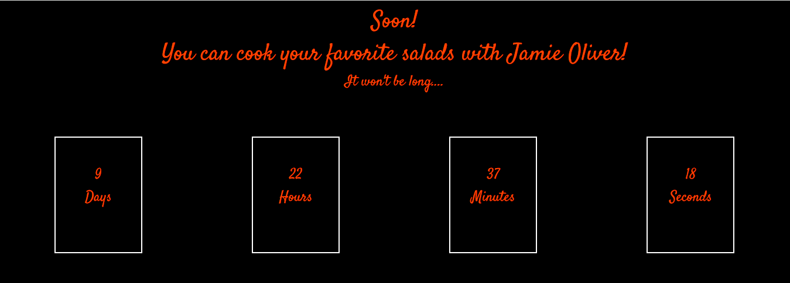
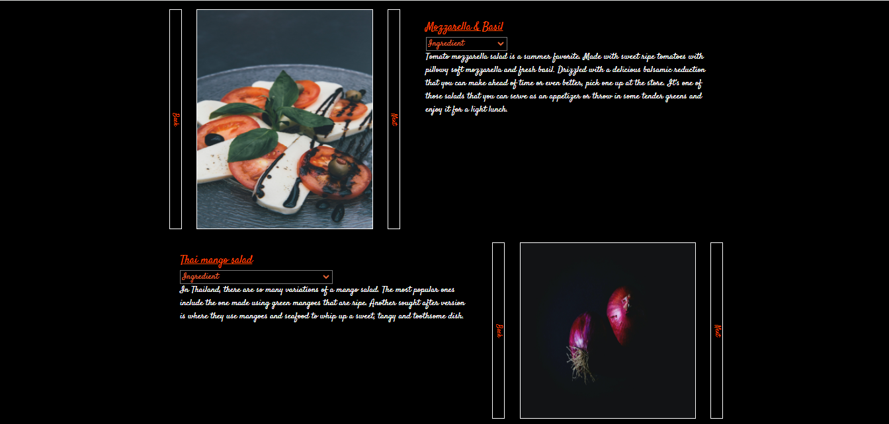
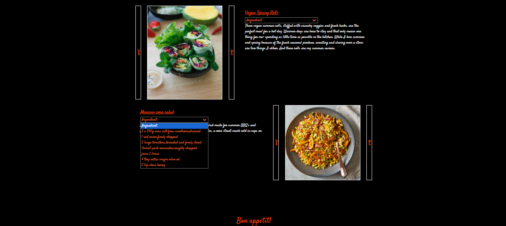

<h1>SALAD RECIPES</h1>

 The main goal is to create coocking salad site.

 <h3>Features</h3>

  - There is the countdown. When the certain date is the new recipe will be on the site by default;

  - the useres can turn over the photo clicking "Next/Back";
  - the users can look through the ingredients;
  
  
  - pushing the salad title the user can follow the link
  
<h3>Contributing</h3>
Bug reports and/or pull requests are welcome.

-----

Made using HTML/CSS/JavaScript
